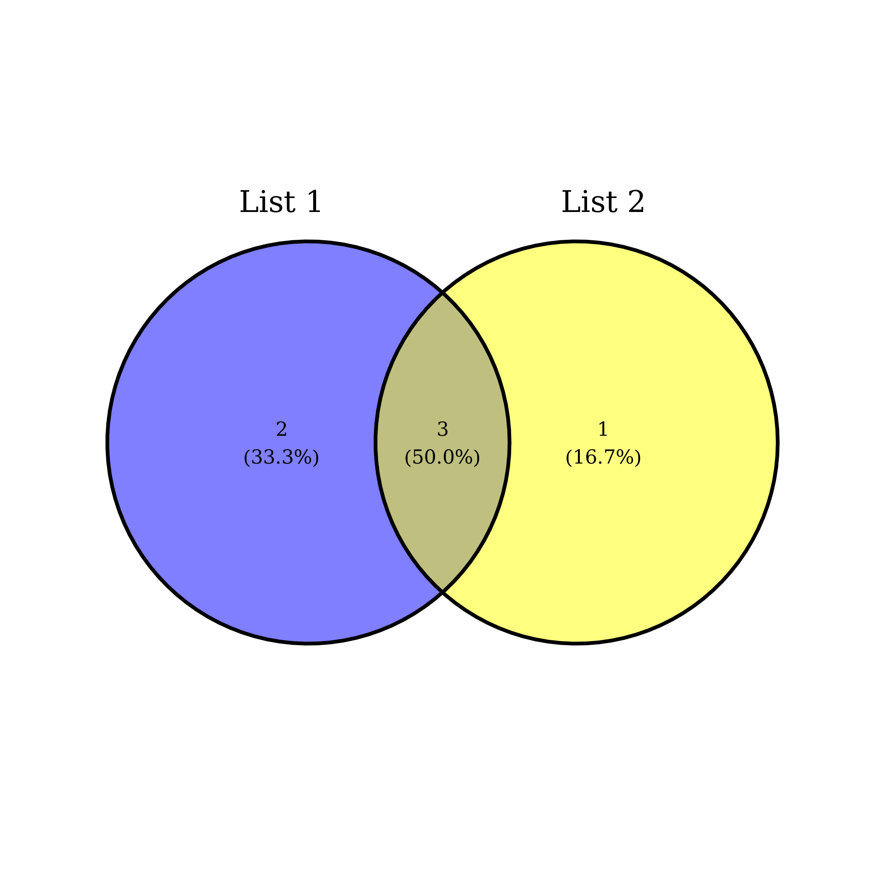
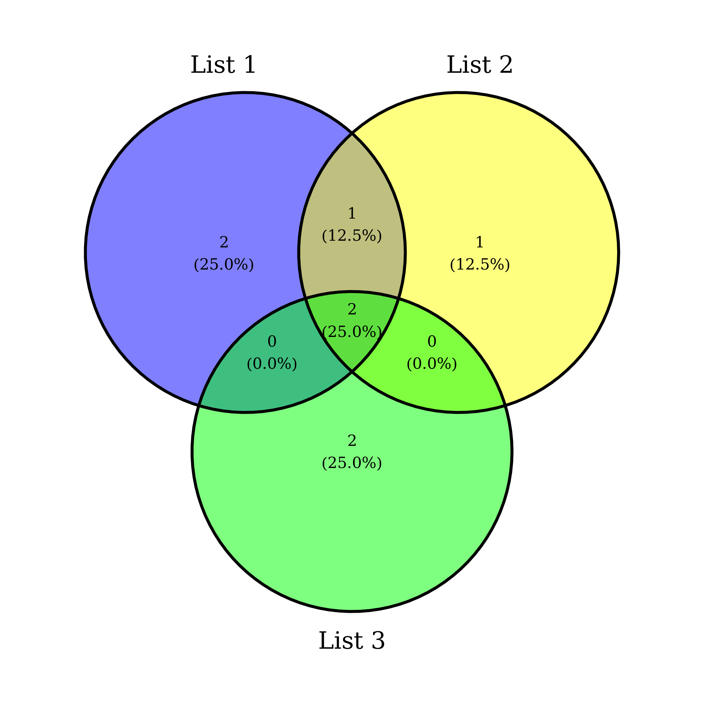
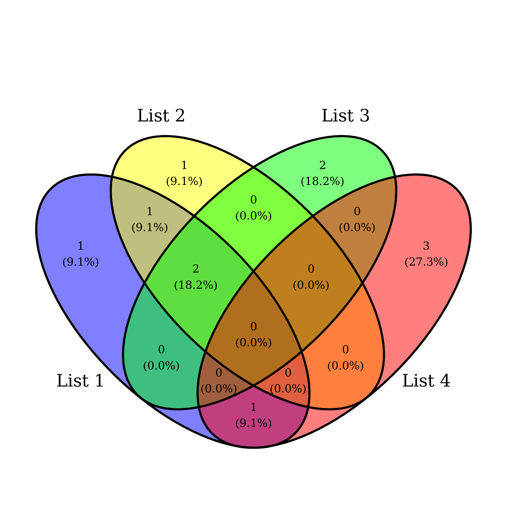

# ggvenn

Venn Diagram by ggplot2. This package is inspired by [Venny](http://bioinfogp.cnb.csic.es/tools/venny/index.html)

## Installation

```{r}
#install.packages("devtools")
devtools::install_github("yanlinlin82/ggvenn")
```

## Usage Example

```{r}
library(ggvenn)

a <- list(`List 1` = c(1, 3, 5, 7, 9),
          `List 2` = c(1, 5, 9, 13),
          `List 3` = c(1, 2, 8, 9),
          `List 4` = c(6, 7, 10, 12))
ggvenn(a, c("List 1", "List 2"))
ggvenn(a, c("List 1", "List 2", "List 3")))
ggvenn(a)

d <- data.frame(value = c(1, 2, 3, 5, 6, 7, 8, 9, 10, 12, 13),
                `List 1` = c(T, F, T, T, F, T, F, T, F,  F,  F),
                `List 2` = c(T, F, F, T, F, F, F, T, F,  F,  T),
                `List 3` = c(T, T, F, F, F, F, T, T, F,  F,  F),
                `List 4` = c(F, F, F, F, T, T, F, F, T,  T,  F))
ggvenn(d, c("List 1"))
ggvenn(d, c("List 1", "List 2", "List 3"))
ggvenn(d)
```

## Screenshots






