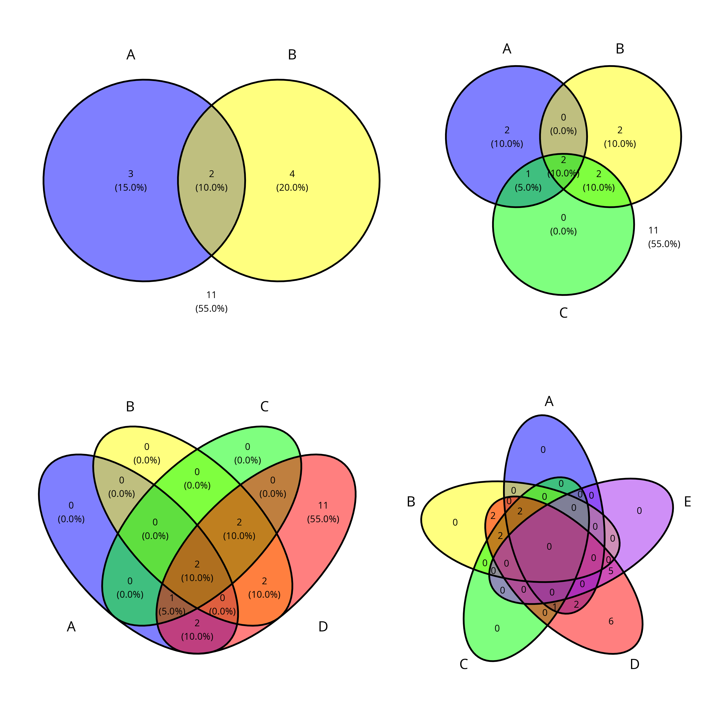
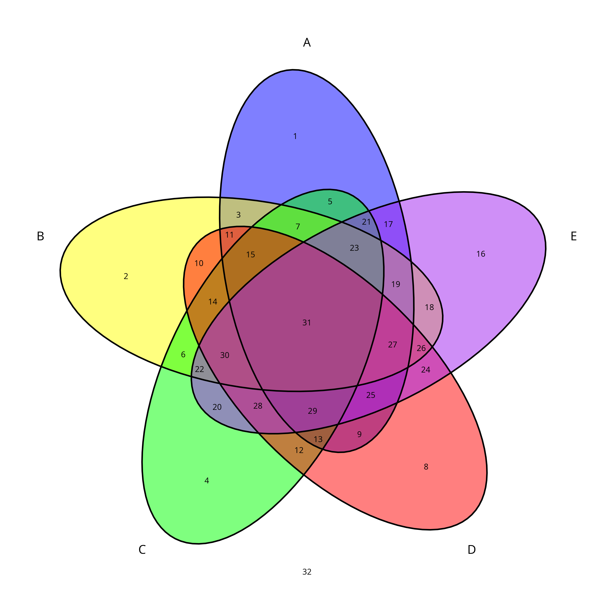

# ggvenn

Venn Diagram by ggplot2, with really easy-to-use API.

<!-- badges: start -->
[](https://github.com/yanlinlin82/ggvenn/actions/workflows/R-CMD-check.yaml)
<!-- badges: end -->

## Screenshots





## Installation

```{r}
install.packages("ggvenn") # install via CRAN
```

or

```{r}
if (!require(devtools)) install.packages("devtools")
devtools::install_github("yanlinlin82/ggvenn") # install via GitHub (for latest version)
```

## Quick Start

This package provides two main functions: `ggvenn()` and `geom_venn()`. It supports both `list` and `data.frame` type data as input.

### Basic Usage

For `list` data (each element is a set):

```{r}
library(ggvenn)

a <- list(A = 1:5, B = 4:9, C = 3:7, D = 1:20, E = 15:19)
ggvenn(a, c("A", "B"))            # draw two-set venn
ggvenn(a, c("A", "B", "C"))       # draw three-set venn
ggvenn(a, c("A", "B", "C", "D"))  # draw four-set venn
ggvenn(a)   # without set names, all elements in list will be chosen to draw venn
```

For `data.frame` data (each logical column is a set):

```{r}
d <- data.frame(
  id = 1:32,
  A = 1:32 %% 2 == 1,
  B = (1:32 %/% 2) %% 2 == 1,
  C = (1:32 %/% 4) %% 2 == 1,
  D = (1:32 %/% 8) %% 2 == 1,
  E = (1:32 %/% 16) %% 2 == 1
)
ggvenn(d, c("A", "B"))            # draw two-set venn
ggvenn(d, c("A", "B", "C"))       # draw three-set venn
ggvenn(d, c("A", "B", "C", "D"))  # draw four-set venn
ggvenn(d)  # without set names, all logical columns in data.frame will be chosen to draw venn
ggvenn(d, element_column = "id", show_elements = TRUE)
```

### Key Features

- **Two functions**: `ggvenn()` for standalone plots, `geom_venn()` for ggplot2 grammar
- **Multiple sets**: Supports 2-8 sets (optimal for 2-4 sets)
- **Flexible input**: Works with both lists and data.frames
- **Customizable**: Colors, sizes, transparency, and text options
- **Show elements**: Display actual elements instead of just counts
- **Auto-scaling**: Automatically resize circles based on element counts (2-set diagrams)

For `data.frame` data, there is also another way to plot in ggplot grammar:

```{r}
# draw two-set venn (use A, B in aes)
ggplot(d, aes(A = `Set 1`, B = `Set 2`)) +
  geom_venn() + theme_void() + coord_fixed()

# draw three-set venn (use A, B, C in aes)
ggplot(d, aes(A = `Set 1`, B = `Set 2`, C = `Set 3`)) +
  geom_venn() + theme_void() + coord_fixed()

# draw four-set venn (use A, B, C, D in aes)
ggplot(d, aes(A = `Set 1`, B = `Set 2`, C = `Set 3`, D = `Set 4`)) +
  geom_venn() + theme_void() + coord_fixed()
```

## More Options

There are more options for customizing the venn diagram.

1. Tune the color and size

    For filling:

    - `fill_color` - default is c("blue", "yellow", "green", "red")
    - `fill_alpha` - default is 0.5

    For stroke:

    - `stroke_color` - default is "black"
    - `stroke_alpha` - default is 1
    - `stroke_size` - default is 1
    - `stroke_linetype` - default is "solid"

    For set name:

    - `set_name_color` - default is "black"
    - `set_name_size` - default is 6

    For text:

    - `text_color` - default is "black"
    - `text_size` - default is 4

    All parameters above could be used in both `ggvenn()` and `geom_venn()`.

    For example:

    ```{r}
    a <- list(A = 1:4, B = c(1,3,5))
    ggvenn(a, stroke_linetype = 2, stroke_size = 0.5,
      set_name_color = "red", set_name_size = 15,
      fill_color = c("pink", "gold"))
    ```

2. Show elements

    - `show_elements` - default is FALSE
    - `label_sep` - text used to concatenate elements, default is ","

    For example:

    ```{r}
    a <- list(A = c("apple", "pear", "peach"),
              B = c("apple", "lemon"))
    ggvenn(a, show_elements = TRUE)

    ggvenn(a, show_elements = TRUE, label_sep = "\n")  # show elements in line
    ```

3. Hide percentage

    - `show_percentage` - default is TRUE

    For example:

    ```{r}
    a <- list(A = 1:5, B = 1:2)
    ggvenn(a, show_percentage = FALSE)
    ```

4. Change digits of percentage

    - `digits` - default is 1

    For example:

    ```{r}
    a <- list(A = 1:5, B = 1:2)
    ggvenn(a, digits = 2)
    ```

5. Show/hide statistics

    - `show_stats` - control what to display: "cp" (count + percentage), "c" (count only), "p" (percentage only)
    - `show_set_totals` - show totals for each set: "cp", "c", "p", or "none"

    For example:

    ```{r}
    a <- list(A = 1:5, B = 1:2)
    ggvenn(a, show_stats = "c")        # show only counts
    ggvenn(a, show_stats = "p")        # show only percentages
    ggvenn(a, show_set_totals = "cp")  # show set totals
    ```

6. Control outside elements

    - `show_outside` - show elements not belonging to any set: "auto", "none", "always"

    For example:

    ```{r}
    a <- list(A = 1:5, B = 4:8, C = 10:15)  # element 10-15 are outside A and B
    ggvenn(a, c("A", "B"), show_outside = "always")
    ```

7. Auto-scaling (2-set diagrams only)

    - `auto_scale` - automatically resize circles based on element counts

    For example:

    ```{r}
    a <- list(A = 1:100, B = 50:150)  # very different sizes
    ggvenn(a, auto_scale = TRUE)
    ```

## Multiple Plots Layout

When creating multiple venn diagrams, you can use `patchwork` or `gridExtra` for layout:

```{r}
library(ggvenn)
library(patchwork)  # or library(gridExtra)

# Create multiple plots
g1 <- ggvenn(list(A = 1:5, B = 4:8))
g2 <- ggvenn(list(A = 1:5, B = 4:8, C = 3:7))
g3 <- ggvenn(list(A = 1:5, B = 4:8, C = 3:7, D = 1:20))
g4 <- ggvenn(list(A = 1:5, B = 4:8, C = 3:7, D = 1:20, E = 15:19))

# Using patchwork (recommended)
(g1 | g2) / (g3 | g4)

# Using gridExtra
# gridExtra::grid.arrange(g1, g2, g3, g4, ncol = 2, nrow = 2)
```

## Data Format

The `ggvenn` support two types of input data: list and data.frame. Two functions (`data_frame_to_list()` and `list_to_data_frame()`) can convert data between the two types.

```r
a <- list(A = 1:5, B = 4:6)
d <- dplyr::tibble(key = 1:6,
            A = c(rep(TRUE, 5), FALSE),
            B = rep(c(FALSE, TRUE), each = 3))

identical(a, data_frame_to_list(d))  # TRUE
identical(d, list_to_data_frame(a))  # TRUE
```
